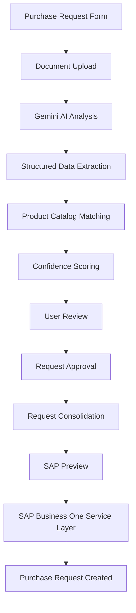

# AI-Assisted SAP Business One Purchase Request Automation

> An AI-powered purchasing automation system that transforms manually completed request forms into structured, validated data and creates Purchase Requests in SAP Business One.


---

## 🚀 Overview

This project was developed to digitalize and automate a real-world purchasing process where purchase requests are submitted through manually completed forms.

The system combines **Artificial Intelligence, document processing, intelligent product matching, backend development, business process automation, and SAP Business One integration**.

### Workflow

**Purchase Form → AI Document Analysis → Product Matching → User Validation → Request Consolidation → SAP Business One**

---

## ✨ Key Features

- 📄 Upload purchase request forms in PDF and image formats
- 🤖 Extract structured data using the **Google Gemini API**
- 🔎 Automatically match extracted products with the internal product catalog
- 📊 Calculate and display **confidence scores**
- ✏️ Allow users to review and correct AI-generated matches
- 🧠 Learn alternative product names from validated corrections
- ✅ Approve individual purchase requests
- 🔗 Consolidate multiple approved requests into a single request
- ➕ Automatically calculate weekly product quantities
- 📤 Export data as **Excel, CSV, and JSON**
- 👁 Preview purchasing data before SAP submission
- 🔄 Integrate with **SAP Business One Service Layer**
- 🧾 Create real SAP Business One **Purchase Request** documents
- 💾 Store SAP `DocEntry` and `DocNum` values
- 🛡 Prevent duplicate SAP submissions
- 🐳 Run the application using Docker

---

## 🧠 AI-Powered Product Matching

The application uses AI to extract information from uploaded purchase request forms.

Extracted product names are automatically compared with the internal product catalog.

The matching process supports:

- Exact product matching
- Alternative product names
- Fuzzy matching
- Confidence scoring
- Manual validation
- Alias learning from user corrections

This allows the system to correctly identify products even when users write names differently from their official SAP catalog names.

---

## 🔄 System Architecture



---

## 💻 Tech Stack

| Area | Technologies |
|---|---|
| **Backend** | Python, Django, Django ORM |
| **Artificial Intelligence** | Google Gemini API, Google GenAI SDK |
| **Product Matching** | RapidFuzz |
| **Database** | SQLite |
| **SAP Integration** | SAP Business One, Service Layer, REST/OData API |
| **Data Processing** | OpenPyXL, Pillow |
| **Deployment** | Docker, Docker Compose |
| **Version Control** | Git, GitHub |

---

## 🏢 SAP Business One Integration

The application communicates with **SAP Business One Service Layer** using REST/OData APIs.

The SAP integration includes:

- Service Layer authentication
- SAP-compatible payload generation
- Purchase Request validation
- Automatic Purchase Request creation
- SAP response handling
- `DocEntry` and `DocNum` storage
- Duplicate submission protection

Sensitive SAP credentials and connection details are managed using environment variables.

---

## 🧩 Main Application Services

The application's business logic is separated into dedicated services.

| Service | Responsibility |
|---|---|
| `gemini_service.py` | AI-based document analysis |
| `product_matching_service.py` | Product catalog matching |
| `alias_learning_service.py` | Alternative product name learning |
| `approval_service.py` | Purchase request approval |
| `consolidation_service.py` | Request consolidation |
| `consolidation_export_service.py` | Excel, CSV and JSON export |
| `sap_service_layer_client.py` | SAP Service Layer communication |
| `sap_purchase_request_builder.py` | SAP payload generation |
| `sap_purchase_request_service.py` | Purchase Request creation and SAP response management |

---

## 📁 Project Structure

```text
satin-alma-talebi-ai/
│
├── config/
│
├── requests_app/
│   ├── migrations/
│   ├── services/
│   ├── templates/
│   ├── admin.py
│   ├── forms.py
│   ├── models.py
│   ├── urls.py
│   └── views.py
│
├── static/
├── templates/
│
├── Dockerfile
├── compose.yaml
├── .env.example
├── .gitignore
├── requirements.txt
├── test_sap_login.py
└── manage.py
```

---

## 🐳 Running the Project

### Clone the repository

```bash
git clone <repository-url>
cd satin-alma-talebi-ai
```

### Create the environment file

```bash
cp .env.example .env
```

For PowerShell:

```powershell
Copy-Item .env.example .env
```

### Start the application

```bash
docker compose up --build
```

The application will be available at:

```text
http://127.0.0.1:8001/
```

### Run database migrations

```bash
docker compose exec web python manage.py migrate
```

### Create an admin user

```bash
docker compose exec web python manage.py createsuperuser
```

---

## 🔐 Security

Sensitive information is never intended to be stored directly in the source code.

The following files should not be committed:

```text
.env
db.sqlite3
media/
.venv/
```

Sensitive values are managed through environment variables, including:

- Gemini API keys
- SAP usernames and passwords
- Django secret keys
- Database credentials
- Internal infrastructure information

---

## ✅ Project Status

The current version is a working **MVP / internal demo prototype**.

### Completed

- ✅ Document upload
- ✅ Gemini AI document analysis
- ✅ Product catalog management
- ✅ AI-assisted product matching
- ✅ Confidence scoring
- ✅ Manual validation
- ✅ Alternative name learning
- ✅ Request approval workflow
- ✅ Request consolidation
- ✅ Excel / CSV / JSON export
- ✅ SAP Business One Service Layer integration
- ✅ SAP Purchase Request creation
- ✅ SAP `DocEntry` / `DocNum` storage
- ✅ Duplicate submission protection
- ✅ Dockerized environment

---

## 🎯 What This Project Demonstrates

This project demonstrates hands-on experience in:

**Artificial Intelligence · SAP Business One · ERP Integration · Business Process Automation · Python · Django · REST APIs · Document Processing · Intelligent Product Matching · Database Design · Docker · Git**

It also demonstrates the ability to transform a real business requirement into an **end-to-end working technical prototype combining AI, backend development and enterprise system integration**.

---

## ⚠️ Disclaimer

This repository is shared as a **portfolio and technical demonstration project**.

Real company data, SAP credentials, API keys, customer information and confidential infrastructure details are not included in the repository.
